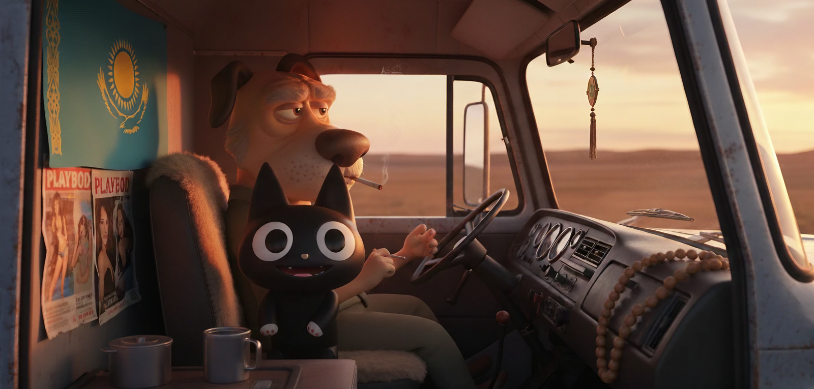
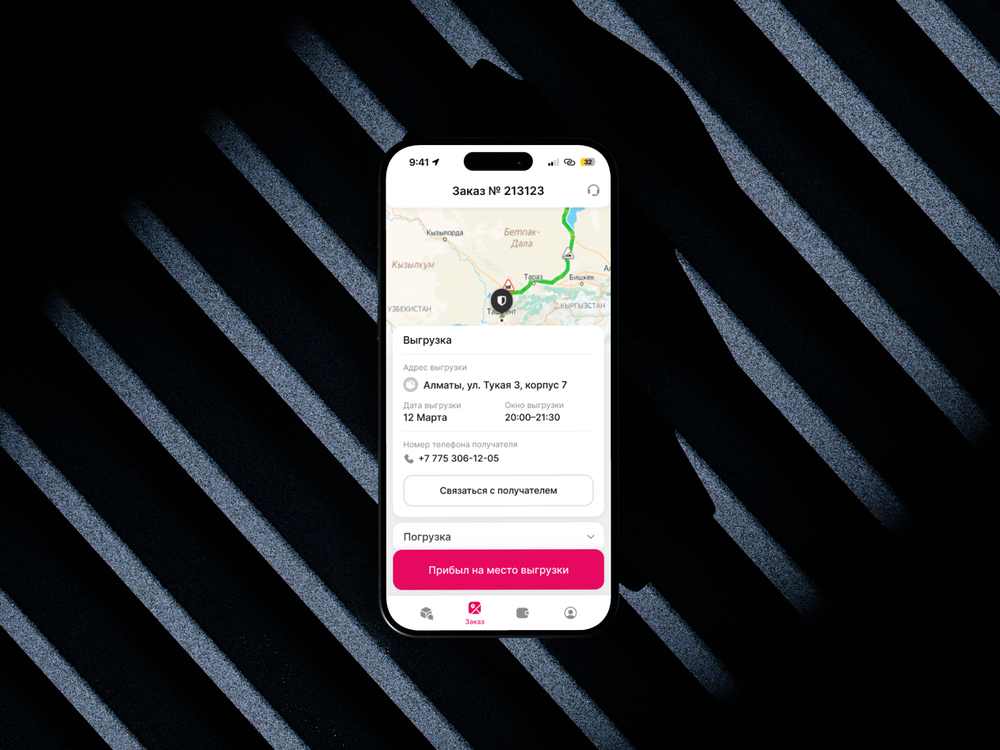
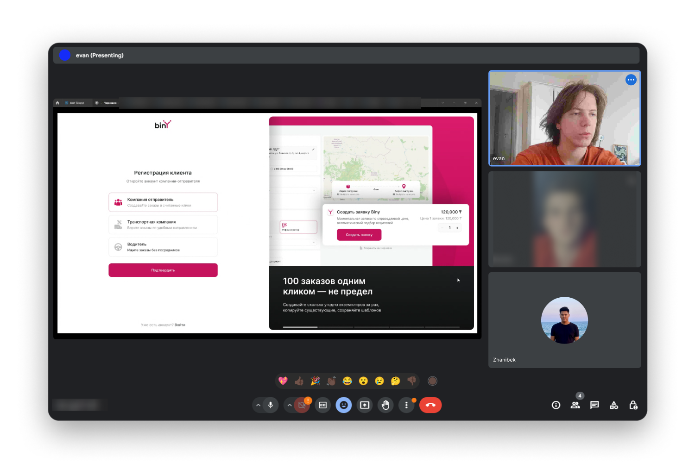

# Казахам 50+ нравится это водительское приложение

## Кратко

- 200+ экранов
- 50+ сессий исследований (кастдев, юзабилити)
- 20+ обновлений за год
- обучение водителей в приложении
- безопасные сделки и вывод средств

| Роль | Продукт дизайнер |
| --- | --- |
| Продукт | Android приложение |
| Деятельность | Сбор и синтез данных, анализ конкурентов, исследование пользователей, вайрфрейминг, дизайн UI |
| Команда | Я, Продукт менеджер, Проект менеджер, Андроид разработчик, Бэкенд разработчик |
| Длительность | 9 месяцев |

### Заказчик

Biny — первый freight-tech и deep-tech стартап из Казахстана, цифровая экосистема для управления логистикой, которая упрощает рутинную работу и грузоотправителей, и исполнителей и экспедиторов

Главная цель, которой живет компания — сделать логистику Центральной Азии прозрачной и доступной

Сейчас насчитывает 4 реализованных продукта: веб-приложение для грузоотправителей, веб-приложение для экспедиторов, мобильное приложение для водителей и умный алгоритм рассчёта стоимости перевозки с ИИ

### Контекст

Водители работают обычно по незамысловатым привычкам: звонки, ватсап, бумажки

В приложении водитель не понимал, где и как найти заказ, как пройти регистрацию, когда будет оплата. Постоянные вопросы, путаница и нагрузка на поддержку. А ещё им 50-60 лет и они не особо разбираются в компах

Буквально каждый водитель постоянно звонил саппорту, но не только из-за непонимания, но и из-за привычки

### Задача

Сделать приложение понятным водителям на каждом шагу

Снизить нагрузку на саппорт

Внушить водителям, что Biny не диспетчер, а цифровой продукт

### Ход работы

Когда я взялся за проект, на проде уже был mvp, так что прежде всего мне предстояло изучить текущий флоу, пообщаться с пользователями (настоящими, будущими, ушедшими), выявить слабые и сильные места продукта 

**План был такой:**

1. Изучение и анализ текущего флоу
2. Анализ конкурентов
3. Формулирование гипотез
4. Интервью с водителями
5. Проверка гипотез
6. Составление user stories
7. Разработка новых дизайн-концепций и прототипов
8. Интеграция
9. Обратная связь от пользователей

Важно учесть, что на старте в приоритете была скорость реализации, так как появлялись новые клиенты и заказы, которые нужно было закрывать как можно скорее, поэтому мы работали под жестким давлением самых срочных сроков

### Исследование

Результат аудита:

- Сложная регистрация со множеством шагов, в которых легко запутаться
- Нехватка базовых фичей типа истории заказа, поддержки и расширенных фильтров и сортировки
- Ошибки в текстах
- Нет фибдека от интерфейса (нет анимаций, сообщений о событиях, текущих статусах процессов и тп)
- Приложение на базе веб не доступно оффлайн, что может подрывать взаимодействие с водителем в участках с медленной сетью

Поговорив примерно с **10 водителями за 3 дня** и проанализировав текущий флоу, я сделал такие записи (здесь без приоритезации):

- Низкий уровень компьютерной грамотности пользователей (портрет аудитории — усреднённый водитель-дальнобойщик 55 лет, эти люди чаще предпочитают предпочитают работать и проводить досуг вне интернета)
- Недостаток интерфейса на родном языке (сейчас большинство пользователей казахи)
- Сложный флоу (регистрация требовала много информации и документов, потом это модерировалось без уведомления пользователя о начале и завершения, почему некоторые водители не могли взять заказ и думая, что приложение не работает, уходили
- Отсутствие понятных инструкций и подсказок (продукт на рынке уникальный, так что опыт взаимодействия с ним для юзеров тоже совершенно уникальный, однако в приложении не было никаких подсказок или даже онбординга)
- У новых пользователей сложно вызвать доверие (бывало из-за непонимания нашей же системы нас называли мошенниками, это в том числе отсылается к предыдущему пункту про информативность пользователей в приложении, в особенности системы оплат)
- Большая нагрузка на модераторов (им, бедным, приходилось компенсировать все вышесказанное, тратить время и силы, чаще увольняться из-за нагрузки и стресса, что сильно сказывается на расходе корпоративных ресурсов)

**Старая версия приложения**

Скрины старого приложения

### Дизайн-задачи

Я установил такие задачи, уже по приоритетам:

1. Упростить флоу регистрации (процент прохождения его был ничтожно мелким, значит до дальнейших дизайн-решений водители даже не дойдут)
2. Добавить инструкции и обучение в приложении (это оказалось на втором месте, потому что требует минимум ресурсов для реализации при большом импакте)
3. Упростить флоу перевозки (приложение должно стать и руководством, и инструментом, а не проблемой, за решением которых приходится писать модераторам)
4. Разработать систему уведомлений (как минимум, юзеров надо оповещать, если что-то случилается, а как максимум — привлекать их к заказам снова и снова)

Задачи второстепенной важности типа доработка фильтров при поиске заказа и совершенствовании личного кабинета мы отложили, чтобы приоретизировать их на основе полученного фидбека от основных нововведений

### **Cхемы взаимодействия**

Перед обновлением приложения требовалось определить новый флоу взаимодействия пользователей в экосистеме

Разработан новый User Flow, обеспечивающий целостность и простоту коммуникации пользователей, упростивший архитектуру бэка и также позволивший сократить нагрузку на модераторов. Сделали большой шаг навстречу ценностям продукта — автоматизации и прозрачности

- Переработаны и упрощены статусы заказов на бэке и фронте
- Внедрили понятные и простые юзерам паттерны в приложении
- Исправлено множество ошибок и дыр в архитектуре
- Определили слабые и сильные места приложения

Эту схему применяли к разработке всей экосистемы, включая приложение Грузоотправителям и приложение Экспедиторам

[https://www.figma.com/file/ZAlRHQcIbThwgAUQ2L8ODb/binY?type=whiteboard&node-id=0%3A1&t=pOLcEl7cMNYjmzsH-1](https://www.figma.com/file/ZAlRHQcIbThwgAUQ2L8ODb/binY?type=whiteboard&node-id=0%3A1&t=pOLcEl7cMNYjmzsH-1)

[Первый User Flow](https://miro.com/app/board/uXjVMXMO3wI=/?share_link_id=624737310760)

Первый User Flow

### Финальный дизайн

- Изменил и протестировал новый UI — сделал элементы минималистичнее и крупнее, подчеркивал цветами только важное
- Упростил флоу
- Учёл устройства водителей
- Отрисовал понятные иллюстрации
- Сделал простой пошаговый и наглядный онбординг
- Сократил количество кнопок на экране в моменте **до 1**

Скрины регистрации

Заказы

Выполнение заказа

Завершение заказа

## Дальнейшие шаги

- Продумать CJM для водителей из контекстной рекламы
- Организация дизайн-системы для всей экосистемы продуктов
- Разработка плана позиционирования и маркетинга на основе полученных данных